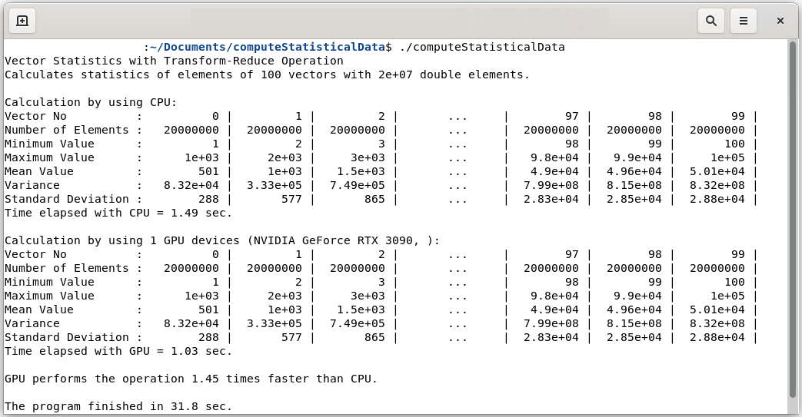

# Statistical Data Calculation on GPUs

CUDA C++ project for calculation of minimum, maximum, mean, variance and standard deviation of vector elements on NVIDIA GPUs.

Measures execution times for the operation on CPU and on GPU and outputs performance comparison.

## Program output

